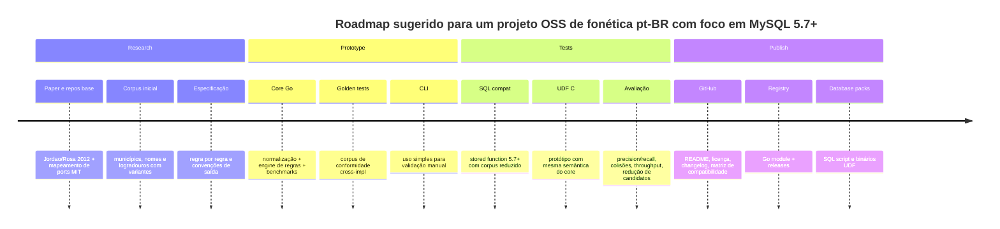

# Relatório analítico sobre algoritmos fonéticos adaptados ao português brasileiro

## Resumo executivo

O ecossistema de algoritmos fonéticos para **português brasileiro** existe, mas é fragmentado. O ponto de referência mais sólido continua sendo o trabalho de **Carlos C. Jordão**, tanto no paper **“Metaphone-pt_BR: The Phonetic Importance on Search and Correction of Textual Information”** quanto no repositório `carlosjordao/metaphone-ptbr`, que documenta a motivação linguística do algoritmo, a tabela simplificada de regras e implementações/empacotamentos para PostgreSQL, PHP e Python. O mesmo material afirma de forma explícita que **Soundex e Metaphone/Double Metaphone em sua forma original não funcionam satisfatoriamente para português**, em especial por não modelarem bem `lh`, `nh`, muitos casos de `x`, `r` inicial/final e várias reduções ortográficas comuns em pt-BR. citeturn9view0turn8view1turn8view2turn8view3turn32view0

Em termos de **código público reutilizável**, há hoje várias trilhas: uma base canônica em C/embeddings Python/PHP ligada ao projeto original; ports e reimplementações em **Go**, **Python**, **PHP**, **Node/TypeScript** e **R**; adaptações de **SoundexBR**; e exemplos de integração em bancos como **PostgreSQL**, **Elasticsearch**, **SQL Server** e até **MySQL em SQL puro**. A melhor notícia para um projeto novo é que há implementações com **licenças permissivas MIT** disponíveis em Python, Go, PHP e Node, o que abre caminho para um port aberto sem ficar preso a GPL/LGPL — mas também há um alerta importante: o repositório original de Jordão **não exibe uma licença clara na página do GitHub**, então ele é excelente como **referência algorítmica e científica**, porém **não deve ser copiado literalmente** para um projeto MIT/Apache sem uma verificação jurídica adicional. citeturn21search5turn20view0turn20view2turn25view0turn29view0turn31search8turn31search9

Para um projeto voltado a **MySQL 5.7+**, a melhor estratégia técnica não é começar pelo SQL puro como implementação “canônica”. O caminho mais seguro e sustentável é: **definir primeiro uma especificação e um corpus de conformidade**, depois publicar uma **implementação de referência em Go** ou outra linguagem moderna, e só então derivar uma versão **UDF em C** e/ou uma versão **SQL pura**. Isso reduz divergência semântica, facilita testes cross-engine e evita que o projeto morra preso a limitações de stored functions do MySQL, como requisitos de `DETERMINISTIC`/`NO SQL`, restrições de replicação e a complexidade operacional das UDFs. citeturn32view1turn32view2turn32view3turn18view1turn37view0

Minha recomendação prática, pensando em um projeto aberto, é esta: **nomear o algoritmo como uma implementação pública de “Metaphone PT-BR” ou “Phonetic PT-BR” para nomes, cidades e ruas**, usar **MIT** ou **Apache-2.0**, construir a semântica a partir do **paper de 2012** e de **reimplementações MIT modernas**, e tratar a entrega em três camadas: **core de regras**, **test corpus**, **bindings/integrações**. Para MySQL, eu priorizaria primeiro **Go + CLI + testes**, depois **UDF C**, e por último uma **stored function SQL compatível 5.7** como edição “fallback”, porque o custo/benefício dessa ordem é melhor. citeturn9view0turn25view0turn21search5turn32view2turn37view0

## Repositórios públicos e código relevante

A tabela abaixo prioriza repositórios que ajudam de verdade num port para pt-BR e/ou MySQL. O critério de “maturidade” aqui é prático: histórico de commits, existência de testes, releases, publicação em registry e clareza de manutenção. Quando eu disser “link direto”, o nome do repositório está citado e clicável.

| Prioridade | Repositório | Linguagem | Licença | Maturidade | Arquivos relevantes | Trecho/ideia a observar |
|---|---|---|---|---|---|---|
| Alta | `carlosjordao/metaphone-ptbr` citeturn11search2turn5view0 | C + wrappers | **Licença não exibida claramente no GitHub** | Alta como referência algorítmica; média como base de reuso jurídico | `source/metaphone_ptbr.c`, `python/metaphone_ptbrpy.c`, `postgresql/`, `README` | Regras simplificadas `LH -> 1`, `NH -> 3`, `^R -> 2`, `R$ -> 2`, `SC[EI] -> S`, `SC[AUO] -> SK`; README explica por que o Metaphone inglês não serve bem para pt-BR. citeturn8view1turn8view2turn8view3turn24view0 |
| Alta | `tondatto/metaphone-pt` citeturn25view0 | Python | MIT | Média/alta como projeto moderno de referência; baixa adoção ainda | `src/metaphone_pt/engine.py`, `src/metaphone_pt/ptbr.py`, `tests/` | Implementação com **engine orientada a regras** e suíte de regressão. README documenta símbolos `1/LH`, `2/R forte`, `3/NH`, `X`, `KS`. Excelente base conceitual para uma especificação aberta. citeturn10view3turn35view2 |
| Alta | `harrison3000/go-metaphone-ptbr` citeturn5view1turn21search5 | Go | MIT | Média | `metaphone.go` | Port direto do C. A função `Metaphone_s` e o `switch` com casos como `L`/`LH -> '1'` mostram um port relativamente fiel e simples de portar para biblioteca de produção em Go. citeturn7view6turn35view0 |
| Alta | `Escavador/pymetaphone-br` citeturn5view3turn21search0 | Python | LGPL-2.1 | Média | `pymetaphone_br/`, `tests/`, `pyproject.toml` | Reescrita em Python do projeto de Jordão, publicada em PyPI. Boa para estudar API/uso e casos de teste; ruim se a meta é reuso permissivo em MIT/Apache. citeturn5view3turn21search4 |
| Alta | `dmarcelinobr/SoundexBR` citeturn17search5turn26search3 | R + código compilado | GPL (>=2) | Média | `README.md`, `DESCRIPTION`, `src/` | Melhor referência pública para **Soundex adaptado ao português**. Serve bem como **baseline** e para medir ganhos/perdas de Metaphone-PTBR. citeturn16view1turn17search14turn26search8 |
| Média | `DanielFillol/metaphone-br` citeturn5view2 | Go | não claramente consolidada na página aberta | Média/experimental | `metaphonebr.go` | Reimplementação em Go usando **regras regex** (`regexp.MustCompile`). Útil para pensar um motor de regras declarativas e geração automática de testes. citeturn24view7turn35view1 |
| Média | `philipecampos/metaphone-pt-br` citeturn29view0turn28view0 | PHP | MIT | Média/baixa no GitHub; melhor sinal em distribuição Composer | `composer.json`, `metaphone/src/` | Pacote PHP com distribuição no Packagist e cerca de cinco mil installs na página observada. É uma trilha PHP permissiva útil para integração web e comparação de API. citeturn28view0turn30search2 |
| Média | `larabra/metaphone` citeturn5view4turn21search2 | PHP | MIT | Baixa/média | `src/Metaphone`, `composer.json` | Repositório PHP enxuto, com releases antigos. Menos rico em documentação, mas com licença permissiva. citeturn5view4 |
| Média | `bipbop/metaphone-ptbr` citeturn20view1turn21search7 | C/JS/C++ | MIT | Média | `lib/`, `tests/`, `main.cpp`, `php/` | Importante como **port MIT** do algoritmo usado em Node, com testes e histórico de uso. Ótimo candidato a leitura para um projeto MIT/Apache que não queira depender do código original sem licença explícita. citeturn20view0turn20view1 |
| Média | `oloko64/metaphone-ptbr-node` citeturn25view1 | TypeScript | MIT | Baixa ainda, mas moderna | `metaphone.ts`, `__test__/`, `README.md` | Fork moderno com ESM/TS e testes. Boa referência de ergonomia e release engineering para “versão moderna” do algoritmo. citeturn25view1 |
| Média | `ipeadata-lab/metaphonebr` citeturn16view0 | R | MIT encontrado, mas página indica “Unknown, MIT licenses found” | Média/alta como variação moderna | `R/`, `tests/`, `README.md` | Variante moderna que **preserva vogais finais** para ajudar a distinguir nomes como Adriano/Adriana. Excelente como inspiração de “v2” orientada a record linkage brasileiro. citeturn16view0 |
| Apoio | `injecto/mymetrics` citeturn5view7turn36search12 | C/C++ UDF MySQL | GPL-3.0 | Média | `src/dmetaphone.cc` | Não é pt-BR, mas é a melhor evidência de que **UDF de métricas** em MySQL funciona e tende a ser mais rápida que stored functions. Serve como molde arquitetural para uma UDF pt-BR. citeturn5view7turn32view2 |
| Apoio | `AtomBoy/double-metaphone` citeturn37view0turn37view1 | Python + MySQL SQL | sem licença clara na página resumida | Média histórica | `metaphone.sql` | Mostra que uma implementação **SQL pura** de Double Metaphone para MySQL é possível, mas longa e delicada. Ótimo estudo de viabilidade; péssimo ponto de partida para pt-BR sem uma especificação antes. citeturn37view1 |
| Apoio | `IvanSantos10/SqlMultiSoundexSearch` citeturn18view1 | MySQL SQL | não evidente na página aberta | Baixa/média | `README.md` | Exemplo didático de `soundex_ptbr`, `remove_accents`, `multisoundex`, `hassoundex` e uso com `levenshtein`. Bom como demonstração de UX/integração em banco. citeturn18view1 |
| Apoio | `alessandromirandagoncalves/soundex-portugues` citeturn18view0turn12search9 | T-SQL | não evidente na página aberta | Baixa/média | scripts SQL | Mostra adaptação fonética para português no SQL Server. Útil como inspiração histórica de SQL procedural, não como base direta para MySQL. citeturn6view4 |
| Apoio | `anaelcarvalho/elasticsearch-analysis-metaphone_ptBR` citeturn5view8turn6view7 | Java/Elasticsearch | Apache-2.0 | Média | plugin/filter `br_metaphone` | Evidência de adoção do algoritmo em motores de busca/tokenização. Boa pista para integração futura fora do banco. citeturn5view8turn6view7 |

Alguns trechos curtos mostram bem a natureza do problema. No projeto original, a interface Python chama o core C diretamente e expõe uma função `phonetic`, o que é exatamente o tipo de separação que eu recomendo reproduzir num projeto novo: um **core determinístico pequeno** e bindings depois. citeturn34view1

```c
{"phonetic", phonetic_phonetic, METH_VARARGS, phonetic_docstring},
code = Metaphone_PTBR(phoneme, max_length);
```
citeturn34view1

No port em Go, fica cristalino que o algoritmo depende de **contexto posicional** e não cabe bem num “mapa simples de caracteres”: `L` muda para `1` quando encontra `LH`; `R` forte depende de posição; `X` depende de vizinhança. citeturn35view0turn24view1

```go
case 'L':
    if ahead_char == 'H' { MetaphAddChr(primary, '1') }
```
citeturn35view0

No exemplo em SQL puro para MySQL, já aparece o custo de manutenção: loops, `SUBSTRING`, normalização e várias funções auxiliares. Isso é ótimo como “fallback” educacional; não é o melhor centro de gravidade para o projeto. citeturn18view1turn37view1

```sql
CREATE FUNCTION soundex_ptbr(str varchar(255)) RETURNS varchar(10)
```
citeturn18view1

### Leitura crítica por tipo de implementação

Se o objetivo for **port aberto com licença permissiva**, as bases mais confortáveis hoje são as implementações **MIT**: `tondatto/metaphone-pt`, `harrison3000/go-metaphone-ptbr`, `bipbop/metaphone-ptbr`, `philipecampos/metaphone-pt-br`, `larabra/metaphone` e o plugin Elasticsearch em **Apache-2.0**. Já `pymetaphone-br` em **LGPL-2.1** e `SoundexBR` em **GPL** são ótimos para estudo e benchmark, mas exigem mais cuidado se você quiser distribuir um core único em MIT/Apache. O material oficial da ASF e da GNU deixa claro que permissivas como MIT/Apache são flexíveis, enquanto GPL/LGPL impõem condições adicionais; além disso, **Apache-2.0 é compatível com GPLv3, mas não com GPLv2 puro**. citeturn20view1turn25view0turn21search5turn29view0turn31search1turn31search3turn31search8turn31search9

A consequência prática é simples: se a ideia é publicar um **projeto aberto para MySQL 5.7+** e maximizar adoção empresarial, eu não copiaria código de repositórios **sem licença explícita** nem de projetos **GPL** para dentro do core. Eu usaria o paper de Jordão e as implementações MIT modernas como fontes de **especificação funcional**, montando um corpus de equivalência e um implementation guide próprio. citeturn9view0turn11search2turn20view1turn25view0

## Artigos e papers de referência

A bibliografia abaixo foi escolhida com dois objetivos: dar base histórica aos algoritmos e mostrar estudos que tratam **adaptação linguística** e **avaliação de matching fonético**.

| Título | Autores | Ano | Link direto | Resumo curto |
|---|---|---:|---|---|
| *Metaphone-pt_BR: The Phonetic Importance on Search and Correction of Textual Information* | Carlos C. Jordão, João Luís G. Rosa | 2012 | Springer citeturn9view0 | Paper central para pt-BR. Defende a adaptação do Metaphone ao português brasileiro e relata ganhos em busca de nomes e endereços sobre consultas tradicionais. Também referencia Soundex, Metaphone, Double Metaphone, Levenshtein e Jaro/Winkler. citeturn9view0 |
| *Hanging on the Metaphone* | Lawrence Philips | 1990 | citado por Springer e por documentação técnica citeturn9view0turn9view1 | Trabalho original do Metaphone, criado como alternativa ao Soundex para inglês. Continua sendo a âncora conceitual da família Metaphone. citeturn9view0turn9view1 |
| *The Double Metaphone Search Algorithm* | Lawrence Philips | 2000 | artigo técnico disponível em versão web citeturn9view2turn9view0 | Explica por que o Metaphone original perdia “fuzziness” em alguns casos e introduz a ideia de códigos primário/secundário para melhorar cobertura de nomes variados. Ainda assim, é um algoritmo centrado em fonologia inglesa. citeturn9view2turn9view0 |
| *Phonetic String Matching: Lessons from Information Retrieval* | Justin Zobel, Philip Dart | 1996 | ACM/espelhos acadêmicos citeturn19search0turn19search8 | Comparação experimental entre técnicas fonéticas e outras abordagens de matching, usando **precision** e **recall**. Muito útil para desenhar métricas do seu projeto. citeturn19search0turn19search8 |
| *Cross Linguistic Name Matching in English and Arabic* | Andrew Freeman, Sherri Condon, Christopher Ackerman | 2006 | ACL Anthology citeturn19search3 | Não é sobre português, mas é excelente evidência de que **name matching precisa ser linguística e ortograficamente contextualizado**, e que uma distância genérica pode ser melhorada com classes de equivalência por idioma. citeturn19search3 |
| *A Comparison and Analysis of Name Matching Algorithms* | Chuleerat Snae | 2007 | Zenodo citeturn19search1turn19search5 | Revisão comparativa de algoritmos de nome, útil para enquadrar Soundex/Metaphone dentro de um espaço mais amplo de matching probabilístico, híbrido e multicultural. citeturn19search1turn19search5 |
| *A Double Metaphone Encoding for Approximate Name Searching and Matching in Bangla* | Naushad UzZaman, Mumit Khan | 2005 | registros acadêmicos públicos citeturn19search6turn19search14 | Importante como exemplo de **adaptação nacional/idiomática** do Double Metaphone. Reforça a tese de que fonética precisa ser calibrada por língua. citeturn19search6turn19search14 |
| *Phonetic Spelling Algorithm Implementations for R* | James P. Howard II | 2020 | Journal of Statistical Software citeturn27search1turn27search4 | Não é pt-BR, mas documenta implementações modernas de Soundex/Metaphone em R, descrevendo interfaces, detalhes de implementação e benchmarking de uma família de algoritmos fonéticos. Útil como referência de empacotamento e documentação técnica. citeturn27search1turn27search4 |

A principal conclusão transversal desses trabalhos é que **algoritmo fonético é um atalho de indexação e geração de candidatos**, não um resolvedor final de identidade. O paper de Jordão, o artigo de Zobel e a literatura de name matching convergem nessa direção: primeiro você **colapsa variantes sonoras**; depois, em cima do conjunto reduzido, aplica uma métrica de refinamento como Levenshtein ou Jaro/Winkler. citeturn9view0turn19search0turn19search8

## Comparativo técnico dos algoritmos

### O que muda de verdade entre Soundex, Metaphone, Double Metaphone e Metaphone-PTBR

| Algoritmo | Ideia central | Saída típica | Força principal | Fraqueza principal em pt-BR | Observação prática |
|---|---|---|---|---|---|
| Soundex original | Letra inicial + 3 dígitos para grupos consonantais | `A251`, `C460` etc. | Extremamente simples, barato e muito difundido | MySQL documenta que a implementação nativa foi feita para **inglês** e pode falhar em outras línguas, além de não ser confiável com multibyte/utf-8; perde muita nuance de `lh`, `nh`, `x`, `r` forte etc. citeturn32view0 | Serve como baseline e para redução grosseira de candidatos, não como referência pt-BR |
| SoundexBR | Mantém o formato curto do Soundex, mas calibrado para português | Quatro posições | Boa relação simplicidade/ganho sobre Soundex inglês | Continua comprimindo demais a fonética; menos expressivo que Metaphone-PTBR | Excelente benchmark inicial para “antes/depois” de um port pt-BR. citeturn26search3turn16view1 |
| Metaphone original | Representa sons principais do inglês com regras contextuais | código alfanumérico variável | Melhor que Soundex para inglês; mais semântico | Ainda é inglês-cêntrico; README do projeto pt-BR afirma explicitamente que não funciona satisfatoriamente para português. citeturn8view2turn9view1 | Útil como referência histórica, não como implementação final pt-BR |
| Double Metaphone | Gera códigos primário/secundário para acomodar ambiguidade ortográfica | duas chaves possíveis | Melhor cobertura de nomes e estrangeirismos em ecossistema anglófono | Continua modelando outra fonologia; não resolve de forma nativa `lh`, `nh`, finalizações e padrões brasileiros | Bom como baseline “global”, especialmente fora do domínio brasileiro. citeturn9view2turn37view0 |
| Metaphone-PTBR | Regras contextuais para fonética brasileira | código variável com símbolos como `1`, `2`, `3`, `X`, `KS` | Modela `lh`, `nh`, `r` forte, muitos casos de `x`, `ph`, `th`, `sc`, `ç`, reduções e acentuação | Mais complexo, mais sujeito a exceções de nomes estrangeiros e a divergência entre implementações | É o melhor ponto de equilíbrio para nomes, cidades e logradouros brasileiros. citeturn8view1turn10view3turn35view2 |
| Variações modernas de MetaphoneBR | Ajustes orientados a domínio, por ex. preservação de vogais finais | variável | Podem melhorar pairing em domínios específicos | Rompem compatibilidade com o “metaphone ptbr clássico” se não forem versionadas | Valem como “v2 especializada”, não como substitutas silenciosas. citeturn16view0 |

Para **pt-BR**, o problema central não é apenas “acento”. É o conjunto de regras fonéticas contextuais que a implementação precisa respeitar: `LH`, `NH`, `R` inicial/final, `X` em múltiplos comportamentos, `SC` com bifurcação `S`/`SK`, trocas históricas como `PH -> F`, `TH -> T`, e variantes de grafia de nomes e logradouros. O README do projeto `metaphone-pt` resume isso muito bem e alinha com a versão clássica de Jordão. citeturn10view3turn8view1turn35view2

Na prática, isso significa que **SoundexBR** é um ótimo **baseline**, mas **Metaphone-PTBR** tende a produzir uma partição mais útil do espaço de busca. O ganho esperado não é “acertar tudo sozinho”; o ganho esperado é **reduzir mais o universo de candidatos com menos false negatives**, de modo que o segundo estágio de similaridade trabalhe melhor. Essa é exatamente a filosofia declarada no paper de Jordão e na literatura de matching fonético. citeturn9view0turn19search8

### Exemplos de regras que importam para o português brasileiro

A documentação moderna do `metaphone-pt` e o projeto clássico de Jordão convergem em regras como estas: `LH -> 1`, `NH -> 3`, `^R -> 2`, `R$ -> 2`, `PH -> F`, `TH -> T`, `SC[EI] -> S`, `SC[AOU] -> SK`. No port em Go, esse comportamento aparece diretamente em código; na reimplementação regex em Go de Daniel Fillol, ele aparece como padrões ordenados com `regexp.MustCompile`. citeturn35view2turn35view0turn35view1

Essas regras têm impacto evidente em casos brasileiros reais. Um algoritmo que trate apenas grupos consonantais genéricos dificilmente vai aproximar bem pares como **Ayrton/Hairtom**, **Xavier/Chavier**, **Queiroz/Keiroz**, **Filho/Filio** ou **Manhã/Manha**. As implementações modernas e os READMEs citados usam exemplos exatamente nessa linha para demonstrar convergência fonética. citeturn10view3turn5view3turn25view0

## Estratégias de implementação para MySQL

### O que o MySQL já oferece e por que isso não basta

O MySQL já possui `SOUNDEX()`, mas a própria documentação oficial alerta que a função **foi pensada para inglês**, que **outras línguas podem não produzir resultados confiáveis** e que a implementação **não garante consistência com multibyte/utf-8**. Além disso, ele implementa o **Soundex original**, não uma variante aprimorada ou adaptada ao português. Para um projeto brasileiro de cidades, ruas e pessoas, isso já basta para descartar `SOUNDEX()` como solução principal. citeturn32view0

### Trade-offs reais para portar/implementar

| Caminho | Compatibilidade 5.7+ | Desempenho | Manutenção | Operação | Risco | Quando faz sentido |
|---|---|---|---|---|---|---|
| SQL puro em `CREATE FUNCTION` | Muito alta | Baixo a médio | Difícil em regras complexas | Fácil de adotar; zero build nativo | Alta chance de divergência e lentidão em massa | Compatibilidade máxima, POC, fallback e ambientes sem acesso a UDF |
| UDF C/C++ loadable | Alta, desde que a ABI seja tratada por versão | Alta | Média/alta | Exige build, deploy binário, governança de segurança | Risco operacional maior; atenção a upgrades e permissões | Produção de alto volume, busca síncrona dentro do banco |
| Aplicação/serviço em Go | Muito alta | Alta | Alta | Muito boa; CI/CD normal | Menor risco de replicação e menos acoplamento ao banco | Melhor escolha para “core” de referência e para API/ETL |
| SQL puro + coluna materializada | Alta | Boa na consulta; custo no write/ETL | Boa | Simples | Médio | Excelente para catálogos grandes com pré-cálculo |
| Go core + UDF C depois | Alta | Alta | Melhor dos dois mundos | Moderada | Médio | Caminho ideal para projeto OSS bem governado |

O SQL puro é tecnicamente viável. Há precedentes públicos tanto para um `soundex_ptbr` em MySQL quanto para uma implementação completa de Double Metaphone em SQL. O problema é que esse estilo de implementação cresce rápido em complexidade, vira um emaranhado de `SUBSTRING`, `WHILE`, `CASE`, índices 1-based e correções pontuais, e fica difícil de manter sincronizado com o comportamento de outras linguagens. citeturn18view1turn37view1

A **UDF loadable em C/C++** é o caminho mais natural para performance dentro do MySQL. A própria Oracle documenta que funções compiladas podem ser instaladas como loadable functions, invocadas como funções nativas, e dá `udf_example.cc` como modelo. Em contrapartida, a documentação também deixa claro que há diferenciais operacionais: deploy binário, compatibilidade entre versões e atenção a segurança e upgrades. citeturn32view2

As **stored functions** ainda trazem exigências de replicação/binlog que você precisa respeitar. Em MySQL 5.7, a criação de função requer `DETERMINISTIC` ou `NO SQL`/`READS SQL DATA`, e quando `log_bin` está habilitado existe ainda a questão de privilégios e da flag `log_bin_trust_function_creators`. Em outras palavras: mesmo para uma função fonética pura, o projeto precisa documentar corretamente o DDL e o comportamento esperado em replicação. citeturn32view1turn32view3

### Recomendação prática para um projeto aberto

Se o objetivo é publicar algo **útil, aberto e adotável**, eu faria assim:

| Fase | Entrega | Justificativa |
|---|---|---|
| Fase inicial | **Core de referência em Go** + corpus de testes + CLI | Go é excelente para regras de texto, distribuição simples e benchmarking; já há ports públicos para comparação. citeturn21search5turn35view0 |
| Fase seguinte | **Pacote SQL puro “compat” para MySQL 5.7+** | Ajuda adoção imediata, prova portabilidade e atende ambientes restritos. Deve mirar compatibilidade, não performance máxima. citeturn18view1turn32view1 |
| Fase de aceleração | **UDF C/C++** | Usa o core/spec como verdade semântica e entrega performance server-side. A documentação da Oracle dá o caminho arquitetural. citeturn32view2 |
| Fase de ecossistema | Bindings/integrações para PostgreSQL, Elasticsearch, libs de aplicação | Há precedentes públicos nesses ecossistemas; isso aumenta adoção e validação cruzada. citeturn8view3turn5view8 |

Minha recomendação final é: **não comece pelo MySQL SQL puro como “source of truth”**. Comece por um **núcleo de regras versionado**, preferencialmente em Go e com testes de conformidade. Depois publique a `CREATE FUNCTION` compatível 5.7+ como **edição compatível**, e a UDF C como **edição performática**. citeturn25view0turn21search5turn32view2

### Notas sobre licença para publicar no GitHub

Se vocês quiserem publicar o projeto em **MIT** ou **Apache-2.0**, o mais prudente é **não copiar** trechos substanciais de código de repositórios com licença **não exibida** ou de projetos **GPL/LGPL** para o core. Em termos práticos, MIT é a licença mais simples e permissiva; Apache-2.0 também é permissiva e traz cláusulas de patente úteis. A documentação oficial da ASF e o material da GNU lembram que **Apache-2.0 é compatível com GPLv3, mas não com GPLv2 puro**. citeturn31search1turn31search3turn31search8turn31search9

Isso torna especialmente atraentes, como inspiração e eventualmente como base de reimplementação compatível, os repositórios **MIT** já existentes em Python, Go, PHP e Node. Para uso acadêmico e validação semântica, o paper de Jordão e seu repositório original continuam indispensáveis; para **reuso codificado**, eu trataria esse material como **fonte de especificação**, não como copy-paste. citeturn9view0turn20view1turn25view0turn29view0

## Testes, métricas e roadmap

### Casos de teste que valem a pena desde o primeiro dia

Para **municípios**, eu montaria um corpus baseado em nomes oficiais e variantes sintéticas/observadas, usando listas oficiais do IBGE como backbone. O IBGE mantém tanto páginas de cidades/estados quanto produtos de **estrutura territorial** do país, que são boas fontes de nomes canônicos. citeturn38search0turn38search1turn38search4

Para **logradouros**, vale cruzar abreviações, ortografia antiga/atual, supressão de partículas e ruídos comuns de digitação. O IBGE também mantém uma **Base de Faces de Logradouros do Brasil**, útil como fonte pública de nomes de ruas/arruamentos para benchmark. citeturn38search7turn38search3

Para **nomes de pessoas**, eu faria um corpus misto: nomes públicos frequentes, pares sintéticos e listas oficiais/demográficas quando possível. O próprio IBGE tem o projeto **Nomes no Brasil**, atualizado recentemente. Para avaliação prática, o mais importante aqui é simular ruídos típicos de cadastro: troca de `i/y`, `s/z`, `x/ch`, `qu/k`, `ph/f`, supressão de acentos, simplificação de consoantes geminadas e partículas como `de`, `da`, `dos`. citeturn38search10turn10view3turn25view0

Um conjunto inicial de pares e não-pares deveria cobrir, no mínimo, estes grupos:

- **Pares que devem colapsar**: `Ayrton`/`Hairtom`, `Xavier`/`Chavier`, `Queiroz`/`Keiroz`, `Casas Bahia`/`Cazas Baia`, `João`/`Joao`, `Luiz`/`Luis`, `Thiago`/`Tiago`. As implementações públicas e READMEs já mostram vários exemplos nessa direção. citeturn5view3turn25view0
- **Pares que não devem colapsar indiscriminadamente**: `Adriana`/`Adriano`, `Mara`/`Maria`, `Bento`/`Vento`, `Rosa`/`Rocha`, `Ceará`/`Ceara-Mirim`. A variante do IPEA, por exemplo, preserva vogais finais justamente porque isso carrega informação útil em nomes brasileiros. citeturn16view0
- **Casos difíceis de `X`**: `Xuxa`, `Teixeira`, `Alex`, `Sexo`, `Enxada`, `Tóxico`, `Máximo`. O código clássico e as reimplementações modernas deixam claro que `X` precisa de tratamento contextual forte. citeturn24view0turn24view1turn35view2

### Métricas de avaliação

A literatura clássica de phonetic matching recomenda olhar **precision** e **recall**, e o paper de Jordão reforça o uso do algoritmo como etapa de redução de busca para depois aplicar métricas de proximidade. Para o seu projeto, eu mediria pelo menos cinco blocos: qualidade de agrupamento, redução de candidatos, custo computacional, estabilidade cross-language e impacto por domínio. citeturn19search0turn19search8turn9view0

Uma planilha de avaliação robusta incluiria:

| Métrica | Como ler | Meta prática inicial |
|---|---|---|
| Precision@1 | entre os top resultados, quantos são corretos | alta para consulta “única palavra”; muito alta com filtro por UF/contexto |
| Recall@k | quantos alvos corretos entram no conjunto de candidatos | priorizar recall alto na fase fonética |
| Taxa de colisão | quantos nomes diferentes caem no mesmo código | monitorar por domínio: pessoas, cidades, ruas |
| False split rate | quantos equivalentes fonéticos ficaram separados | crítica para avaliar regras de `x`, `r`, `lh`, `nh` |
| Redução de candidatos | tamanho médio do bloco fonético versus universo total | mede o ganho operacional real |
| Throughput | registros processados por segundo / microssegundos por token | essencial para decidir entre SQL, UDF e aplicação |
| Conformidade cross-impl | % de equivalência entre Go, SQL e UDF no corpus | garante que o projeto não “forke semanticamente” |

Em domínio de **municípios**, eu recomendo sempre medir também **com e sem filtro por UF**. O paper de Jordão foi pensado para nomes e endereços; na prática brasileira, usar o contexto de estado quase sempre aumenta muito a precisão do bloco fonético sem penalizar recall em matching geográfico. Isso é uma inferência operacional coerente com a literatura e com o uso de campos de endereço como contexto. citeturn9view0turn38search1

### Checklist para iniciar o port

#### Checklist para um core em Go

- Definir um **especificador de normalização**: Unicode NFC/NFD, remoção de acentos, caixa alta, preservação ou não de vogais finais, tratamento de espaços e hífens.
- Extrair um **corpus dourado** a partir de exemplos do paper e de saídas conhecidas de `carlosjordao/metaphone-ptbr`, `tondatto/metaphone-pt` e `harrison3000/go-metaphone-ptbr`. citeturn9view0turn25view0turn21search5
- Implementar primeiro o conjunto mínimo de regras: vogais iniciais, `LH`, `NH`, `R` forte, `PH`, `TH`, `C`, `SC`, `X`, `Z$`.
- Rodar benchmark desde o início para tokens curtos e frases com múltiplas palavras.
- Publicar CLI simples: `ptbrphonex "Ayrton Senna"` → `ARTM SN`.

#### Checklist para uma UDF C/C++

- Escolher desde já a ABI alvo e matriz de suporte: **MySQL 5.7**, **MySQL 8**, **Percona Server**.
- Separar **core puro** de **adapter UDF**.
- Tratar UTF-8 e normalização antes da lógica de regras.
- Documentar instalação, permissões e rollback.
- Testar em ambiente com binlog/replicação e validar comportamento operacional. A documentação oficial do MySQL explica por que isso importa mesmo em funções aparentemente simples. citeturn32view1turn32view2turn32view3

#### Checklist para SQL puro

- Escrever primeiro `normalize_ptbr()` ou equivalente.
- Manter a função principal **determinística** e sem leitura/escrita de tabelas.
- Ser muito explícito em `CHAR_LENGTH` versus `LENGTH`, especialmente com UTF-8.
- Cobrir entradas com múltiplas palavras (`multimetaphone_ptbr`) separando espaço, hífen e barra.
- Aceitar que a versão SQL pura provavelmente será **subconjunto compatível** do core, não a mais elegante ou rápida.

### Roadmap sugerido



### Recomendação final de arquitetura

Se eu estivesse abrindo esse projeto hoje, a arquitetura inicial seria:

1. **Especificação pública + corpus** como ativo principal.  
2. **Implementação de referência em Go** sob **MIT** ou **Apache-2.0**.  
3. **Pacote SQL puro** para MySQL 5.7+ como fallback compatível.  
4. **UDF C** para produção e alto volume.  
5. Opcionalmente, depois: adapters para PostgreSQL, Elasticsearch e SDKs.  

Essa ordem conversa muito melhor com o estado real do ecossistema encontrado: o que já existe de melhor em pt-BR está mais forte em **C, PostgreSQL, Python, Go e ports modernos**, enquanto o lado MySQL aparece sobretudo como **exemplo**, **UDF genérica** ou **adaptação artesanal**. Transformar isso num projeto aberto e robusto é perfeitamente viável — desde que o projeto trate a **semântica do algoritmo** como produto principal e a **integração com banco** como camada derivada. citeturn9view0turn11search2turn21search5turn25view0turn5view7turn18view1turn37view0